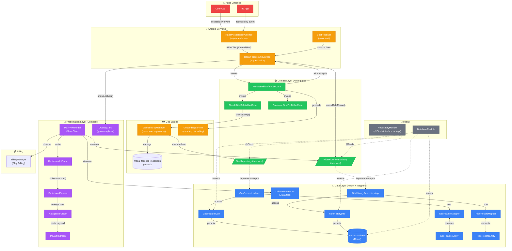

# Radar Carioca — Diagrama de Arquitetura

## Fluxo de Dados Principal



---

## Estrutura de Pacotes

```
app/src/main/java/com/radarcarioca/
│
├── domain/                          ← 🟢 KOTLIN PURO (zero imports Android)
│   ├── repository/
│   │   ├── GeoRepository.kt         ← interface de contrato geo
│   │   └── RideHistoryRepository.kt ← interface de contrato histórico
│   └── usecase/
│       ├── CheckRideSafetyUseCase.kt
│       ├── CalculateRideProfitUseCase.kt
│       └── ProcessRideOfferUseCase.kt
│
├── data/                            ← 🔵 CAMADA DE DADOS (conhece Room)
│   ├── model/
│   │   └── Models.kt                ← entidades de domínio PURAS (sem @Entity)
│   ├── local/
│   │   ├── entity/
│   │   │   ├── GeoFeatureEntity.kt  ← @Entity Room (isolado do domain)
│   │   │   └── RideRecordEntity.kt  ← @Entity Room (isolado do domain)
│   │   ├── Database.kt              ← DAOs + RadarDatabase
│   │   └── DriverPreferences.kt     ← DataStore
│   ├── mapper/
│   │   ├── GeoFeatureMapper.kt      ← Entity ↔ Domain
│   │   └── RideRecordMapper.kt      ← Entity ↔ Domain
│   └── repository/
│       ├── GeoRepositoryImpl.kt     ← implementa GeoRepository
│       └── RideHistoryRepositoryImpl.kt
│
├── geo/
│   └── GeoSecurityManager.kt        ← motor geoespacial (usa GeoRepository)
│
├── financial/
│   └── FinancialCalculator.kt       ← cálculo financeiro puro
│
├── service/                         ← 🤖 ANDROID SERVICES
│   ├── RadarAccessibilityService.kt
│   ├── RadarForegroundService.kt
│   ├── RideProcessor.kt
│   ├── GeocodingService.kt
│   └── BootReceiver.kt
│
├── ui/                              ← 🎨 PRESENTATION (Compose)
│   ├── MainViewModel.kt             ← usa RideHistoryRepository (interface!)
│   └── screens/
│       ├── DashboardScreen.kt
│       ├── OverlayCard.kt
│       ├── PaywallScreen.kt
│       └── OtherScreens.kt
│
├── di/                              ← 💉 HILT
│   ├── DatabaseModule.kt            ← Room + DAOs
│   └── RepositoryModule.kt          ← @Binds interface → implementação
│
└── billing/
    └── BillingManager.kt
```

---

## Regras de Dependência (Clean Architecture)

```
┌─────────────────────────────────────────────────────────┐
│                    PRESENTATION                         │
│   (ViewModel, Compose Screens, Navigation)              │
│         depende de → Domain (Use Cases)                 │
└─────────────────────┬───────────────────────────────────┘
                      │ depende de ↓
┌─────────────────────▼───────────────────────────────────┐
│                      DOMAIN                             │
│   (Entities, Repository Interfaces, Use Cases)          │
│         NÃO depende de nada externo                     │
└─────────────────────┬───────────────────────────────────┘
                      │ implementado por ↓
┌─────────────────────▼───────────────────────────────────┐
│                       DATA                              │
│   (RepositoryImpl, DAOs, Room Entities, Mappers)        │
│         depende de → Domain (interfaces)                │
│         conhece → Room, DataStore                       │
└─────────────────────────────────────────────────────────┘
```

---

## Ciclo de Vida de uma Corrida

```
Uber/99 exibe oferta
        │
        ▼
RadarAccessibilityService   ← lê texto via Accessibility API
        │  RideOffer
        ▼
RadarForegroundService      ← recebe via SharedFlow
        │
        ▼
ProcessRideOfferUseCase
  ├─ GeocodingService       ← endereço → lat/lng
  ├─ CheckRideSafetyUseCase
  │    └─ GeoSecurityManager
  │         └─ GeoRepository  ← lê features do Room
  └─ CalculateRideProfitUseCase
       └─ FinancialCalculator  ← lucro líquido, R$/KM, margem
        │
        ▼ RideAnalysis
 ┌──────┴──────────┐
 ▼                 ▼
OverlayCard    RideHistoryRepository  ← persiste no Room
(GREEN/YELLOW/
 RED/PURPLE)
```

---

## Legenda de Cores

| Cor | Camada |
|-----|--------|
| 🟢 Verde | Domain (Kotlin puro) |
| 🔵 Azul | Data (Room, mappers) |
| 🟣 Roxo | Presentation (Compose) |
| 🟠 Laranja | Android Services |
| ⚫ Cinza | DI (Hilt) |
| 🔴 Vermelho | Externos (Uber/99) |
